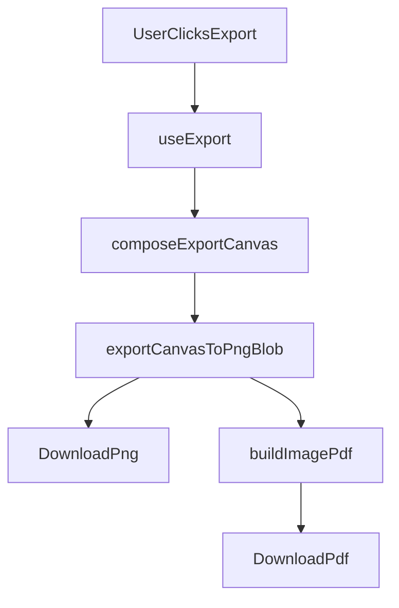

# Phase 2：Export Core 計畫

## 目標與範圍

- 目標：完成 Phase 2 的最小可用匯出能力，支援「匯出圖片」與「匯出 PDF（image-based）」。
- 範圍：僅做 baseline，不提前實作 Phase 3 的 PII 自動遮罩流程。
- 約束：維持現有分層（`core/`、`composables/`、`components/`、`stores/`），避免跨層邏輯混雜。

## 現況對齊

- 目前主流程已在 [src/views/OcrFlowView.vue](d:/2026/Privacy-Shield-Editor/src/views/OcrFlowView.vue) 跑通「上傳 → OCR → 編輯」。
- 文字編輯元件位於 [src/components/ocr/OcrTextEditor.vue](d:/2026/Privacy-Shield-Editor/src/components/ocr/OcrTextEditor.vue)。
- 專案已安裝 `pdf-lib`（可直接用於 PDF baseline）。
- 文件狀態顯示當前目標是完成 Export core（見 [docs/PROGRESS.md](d:/2026/Privacy-Shield-Editor/docs/PROGRESS.md)）。

## 實作策略（最小可用）

1. 先完成圖片匯出：從目前可用來源輸出 PNG（若三層 canvas 尚未完整落地，先採 base 輸出，保留之後併入 maskCanvas 的介面）。
2. 再完成 PDF 匯出：用 `pdf-lib` 將匯出圖嵌入單頁 PDF。
3. 最後接入 UI：在 OCR 流程頁新增兩個匯出操作，並串接 loading/error 狀態。

## 匯出觸發條件與互斥規則（MVP 明確化）

- 匯出圖片（PNG）與匯出 PDF（image-based）在 MVP 階段都不依賴 OCR 結果：
  - 只要已有上傳圖片（`hasImage = true`）即可觸發匯出。
  - 不要求 `hasOcr = true`。
- 匯出與 OCR 必須互斥，避免流程競爭：
  - `isOcrLoading = true` 時，禁用兩個匯出操作。
  - `isExporting = true` 時，禁用 OCR 執行與清除操作。
- 基準判斷式（供 view/composable 對齊）：
  - `canExport = hasImage && !isOcrLoading && !isExporting`
- 匯出失敗需可重試：
  - 失敗時保留錯誤訊息顯示。
  - 下一次匯出開始前清空前次錯誤。

## 功能分工（避免跨層混雜）

- `core/export/*`（純邏輯）
  - `imageExport.ts`
    - `composeExportCanvas(...)`：統一匯出來源（MVP 先支援 base，預留 mask 參數）。
    - `exportCanvasToPngBlob(...)`：canvas 轉 PNG `Blob`。
  - `pdfExport.ts`
    - `buildImagePdf(...)`：輸入 image bytes，輸出單頁 PDF bytes。

- `composables/useExport.ts`（流程編排）
  - `exportImage()`：guard → 組 canvas → 轉 blob → 下載。
  - `exportPdf()`：重用圖片 bytes → `buildImagePdf(...)` → 下載。
  - 統一負責 `startExport / setExportError / finishExport` 呼叫時機。

- `stores/editor.ts`（最小 UI 狀態）
  - 新增 `isExporting`、`exportError`。
  - 新增最小 action：`startExport()`、`setExportError()`、`finishExport()`。
  - 不在本階段加入未使用的預先 API。

- `components + views`（觸發與回饋）
  - `OcrExportPanel.vue` 僅保留當前需要的 props/emits：
    - props：`canExport`、`isExporting`、`error`
    - emits：`export-image`、`export-pdf`
  - `OcrFlowView.vue` 負責接線、互斥 guard 與 disabled 計算，不承載匯出底層邏輯。

## 為何 MVP 仍保留「匯出圖片」

- 匯出圖片不是單純重存原圖，而是建立統一輸出管線（後續可無痛接入 `base + mask` 合成）。
- `exportPdf()` 可重用同一份圖片輸出來源，降低兩條匯出路徑分叉風險。
- 即使 Phase 2 尚未完成三層 canvas，也先固定 `core/composable` 邊界，避免 Phase 3 重構 UI 事件流。

## 檔案級規畫

- `core`（純邏輯）
  - 新增 [src/core/export/imageExport.ts](d:/2026/Privacy-Shield-Editor/src/core/export/imageExport.ts)
    - `composeExportCanvas(...)`：統一匯出來源（先支援 base，預留 mask 合成參數）。
    - `exportCanvasToPngBlob(...)`：回傳 `Blob`。
  - 新增 [src/core/export/pdfExport.ts](d:/2026/Privacy-Shield-Editor/src/core/export/pdfExport.ts)
    - `buildImagePdf(...)`：輸入圖片 bytes，輸出 PDF bytes（單頁）。

- `composables`（流程編排）
  - 新增 [src/composables/useExport.ts](d:/2026/Privacy-Shield-Editor/src/composables/useExport.ts)
    - `exportImage()`：組合 canvas → 轉 blob → 觸發下載。
    - `exportPdf()`：重用圖片 bytes → `pdf-lib` 產生 PDF → 下載。

- `stores`（最小 UI 狀態）
  - 擴充 [src/stores/editor.ts](d:/2026/Privacy-Shield-Editor/src/stores/editor.ts)
    - 新增當前需求所需狀態：`isExporting`、`exportError`。
    - 不新增未使用的未來 API（遵循最小 API 原則）。

- `UI`（觸發與反饋）
  - 新增 [src/components/ocr/OcrExportPanel.vue](d:/2026/Privacy-Shield-Editor/src/components/ocr/OcrExportPanel.vue)
    - 僅保留當前必要 props/emits：`canExport`、`isExporting`、`error`、`export-image`、`export-pdf`。
  - 更新 [src/views/OcrFlowView.vue](d:/2026/Privacy-Shield-Editor/src/views/OcrFlowView.vue)
    - 接入 `useExport()` 與 `OcrExportPanel`。
    - 與 OCR loading 狀態互斥，避免同時 OCR 與匯出。

## 流程圖

## 驗收與測試

- 功能驗收
  - 上傳圖片後可下載 `.png`。
  - 上傳圖片後（未執行 OCR）也可下載 `.pdf`。
  - OCR 執行完成且可編輯文字後，仍可下載 `.png`、`.pdf`。
  - `.pdf` 可正常開啟，頁面尺寸與圖片比例合理。

- 技術驗收
  - `npm run type-check` 通過。
  - `npm run build` 通過。
  - 匯出可用條件符合 `canExport = hasImage && !isOcrLoading && !isExporting`。
  - `isOcrLoading` 與 `isExporting` 互斥規則在 UI 層可觀察（按鈕 disabled）。
  - 匯出失敗時 UI 顯示錯誤，且可再次重試。

## 風險與對策

- 匯出來源不一致（未來三層 canvas 上線後可能重工）
  - 對策：在 `composeExportCanvas` 先定義可擴充參數（base/mask），UI 不依賴底層細節。
- PDF 尺寸失真
  - 對策：以圖片原始寬高比計算 page size，先不做進階排版。
- UI 狀態競爭（OCR 與 export 同時觸發）
  - 對策：在 view/composable 層加互斥 guard 與 disabled 狀態。

## 里程碑

1. 完成 `core/export` 兩個模組並單點驗證輸出 bytes/blob。
2. 完成 `useExport` 串接下載流程。
3. 完成 `OcrExportPanel` + `OcrFlowView` 接線。
4. 跑一次手動 E2E：`upload → OCR → edit → export image/pdf`。
