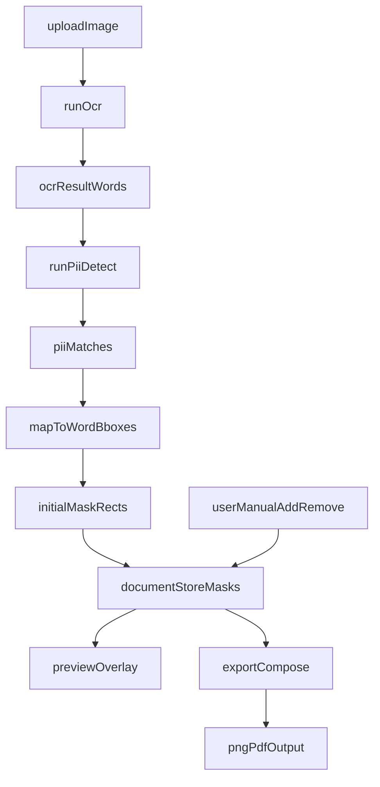

# Phase 3：PII Detection + Mask Baseline Plan

## 目標與對齊

- 對齊架構與階段定義：[d:/2026/Privacy-Shield-Editor/docs/INFO.md](d:/2026/Privacy-Shield-Editor/docs/INFO.md)
- 對齊目前進度與下一步建議：[d:/2026/Privacy-Shield-Editor/docs/PROGRESS.md](d:/2026/Privacy-Shield-Editor/docs/PROGRESS.md)
- 延續既有 Phase 計劃風格與拆分粒度：[d:/2026/Privacy-Shield-Editor/.cursor/plans/phase2_export_core_61a28c80.plan.md](d:/2026/Privacy-Shield-Editor/.cursor/plans/phase2_export_core_61a28c80.plan.md)

## 範圍（Phase 3 MVP）

- 實作 regex 偵測：email / phone / credit card。
- 將偵測結果映射到 OCR word-level bbox，產生初始 mask rectangles。
- 提供最小手動編輯：新增遮罩、移除遮罩。
- 將遮罩納入匯出流程（PNG/PDF 皆反映遮罩結果）。

## 非目標（避免範圍外）

- 不做 Phase 4 完整三層 canvas 互動架構重構。
- 不做進階規則引擎（例如 ML 判斷、可配置規則管理 UI）。
- 不做後端或伺服器上傳，維持全前端處理。

## 主要檔案與責任分工

- `core`（純邏輯）
  - 新增 PII 偵測與 bbox 映射模組：
    - [d:/2026/Privacy-Shield-Editor/src/core/pii/detect.ts](d:/2026/Privacy-Shield-Editor/src/core/pii/detect.ts)
    - [d:/2026/Privacy-Shield-Editor/src/core/pii/mapMatchesToBboxes.ts](d:/2026/Privacy-Shield-Editor/src/core/pii/mapMatchesToBboxes.ts)
    - [d:/2026/Privacy-Shield-Editor/src/core/mask/buildMaskRects.ts](d:/2026/Privacy-Shield-Editor/src/core/mask/buildMaskRects.ts)
- `types`
  - 新增型別（PII match、Mask rect、來源標記 auto/manual）：
    - [d:/2026/Privacy-Shield-Editor/src/types/pii.ts](d:/2026/Privacy-Shield-Editor/src/types/pii.ts)
    - [d:/2026/Privacy-Shield-Editor/src/types/mask.ts](d:/2026/Privacy-Shield-Editor/src/types/mask.ts)
  - **`MaskRect`** 含必填 **`id: string`**（`uuid` 套件 `v4()`）；可選 **`MaskRectInput`**（`id` 可省略）供手動新增，由 store **`addMaskRect`** 自動補 `id`。**合併**出新的幾何時（`buildMaskRects`）**配新 `id`**。**刪除／稍後編輯幾何**以 **`id`** 對齊，不依賴陣列索引。
- `stores`
  - 擴充文件狀態保存遮罩資料與操作 API：
    - [d:/2026/Privacy-Shield-Editor/src/stores/document.ts](d:/2026/Privacy-Shield-Editor/src/stores/document.ts)
- `composables`
  - 新增 Phase 3 flow 編排（detect、生成、手動增刪、重置策略）：
    - [d:/2026/Privacy-Shield-Editor/src/composables/usePiiMask.ts](d:/2026/Privacy-Shield-Editor/src/composables/usePiiMask.ts)
  - 將遮罩接入匯出：
    - [d:/2026/Privacy-Shield-Editor/src/composables/useExport.ts](d:/2026/Privacy-Shield-Editor/src/composables/useExport.ts)
- `components/views`
  - 新增最小 PII/Mask 控制面板（detect + list/remove + minimal add）：
    - [d:/2026/Privacy-Shield-Editor/src/components/ocr/OcrPiiPanel.vue](d:/2026/Privacy-Shield-Editor/src/components/ocr/OcrPiiPanel.vue)
  - 在流程頁接線並維持現有互斥 guard：
    - [d:/2026/Privacy-Shield-Editor/src/views/OcrFlowView.vue](d:/2026/Privacy-Shield-Editor/src/views/OcrFlowView.vue)

## 資料流（MVP）

## 里程碑

- M1: core + types 完成（可從 OCR text/words 產生初始 mask rects）。
- M2: store + composable 完成（可 detect、可 add/remove、可 reset）。
- M3: UI 接線完成（流程頁可操作 PII panel）。
- M4: export 接線完成（PNG/PDF 反映遮罩）。
- M5: 驗收與修正（type-check/build/manual flow）。

## 驗收標準

- 功能驗收
  - 上傳圖片並 OCR 後，可一鍵執行 PII 偵測。
  - 可產生並顯示初始遮罩；可手動新增與刪除遮罩。
  - 匯出 PNG/PDF 時可看到遮罩結果。
- 技術驗收
  - `npm run type-check` 通過。
  - `npm run build` 通過。
  - 手動流程測試通過：upload -> OCR -> edit(optional) -> detect PII -> add/remove mask -> export PNG/PDF。

## 風險與對策

- OCR `correctedText` 與 `ocrResult.words` 可能不一致，造成映射偏差。
  - 對策：MVP 先以 `ocrResult.words` 為主；當文字被大幅編修時提示重新偵測。
- 遮罩幾何過度碎片化，影響視覺與效能。
  - 對策：在 `buildMaskRects` 增加相鄰框合併與最小尺寸過濾。
- UI API 膨脹。
  - 對策：遵守最小 API 原則，只保留當前有父層傳入/監聽需求的 props/emits。
