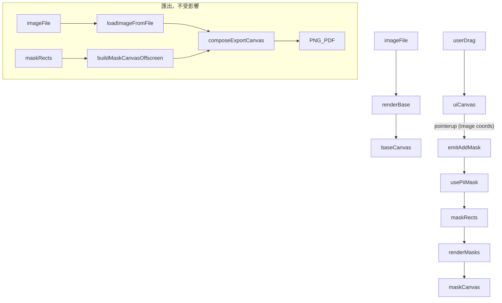

# Phase 4：Canvas Full Workflow 計畫

## 目標與對齊

- 對齊架構：[docs/INFO.md](docs/INFO.md)（Phase 4 = 3-layer canvas full workflow）
- 對齊進度：[docs/PROGRESS.md](docs/PROGRESS.md)（next suggested steps）
- 格式參考：[.cursor/plans/phase3_pii_mask_core_a71a403c.plan.md](.cursor/plans/phase3_pii_mask_core_a71a403c.plan.md)

## 範圍（Phase 4 MVP）

- 以 3 層 canvas 元件取代現有 `` 預覽（[src/components/ocr/OcrImagePreview.vue](src/components/ocr/OcrImagePreview.vue)）
- baseCanvas：顯示原圖（read-only，不參與遮罩邏輯）
- maskCanvas：繪製目前 maskRects（reactive，和 store 同步）
- uiCanvas：捕捉滑鼠互動，顯示拖曳選框預覽，mouseup 後 emit 選取矩形（image 像素座標）
- 匯出管線不動（已用 off-screen canvas，與顯示層無關）

## 非目標

- 不重構匯出管線（`useExport` / `imageExport` / `maskCanvas` 邏輯維持現狀）
- 不做畫筆模式或進階互動（Phase 5+ 再議）
- 不移除 OcrPiiPanel 的數字輸入框（canvas 互動為主要路徑，表單保留作備援）

## 主要新增檔案

### `src/components/ocr/OcrCanvasEditor.vue`（新增）

3 層 canvas 容器元件，負責 DOM 結構與 CSS 疊層：

```
position: relative
  canvas#baseCanvas   z-index:0  pointer-events:none
  canvas#maskCanvas   z-index:1  pointer-events:none
  canvas#uiCanvas     z-index:2  pointer-events:auto  (接收互動)
```

- props：`imageFile: File | null`、`masks: MaskRect[]`、`disabled: boolean`
- emits：`(e: 'add-mask', rect: MaskRectInput): void`
- 以 `templateRef` 把 3 個 canvas 傳入 `useCanvasEditor`

### `src/composables/useCanvasEditor.ts`（新增）

Canvas 渲染與互動 composable，純 canvas 邏輯，無 DOM 元件依賴：

- `renderBase(file: File | null)` — 將圖片繪製到 baseCanvas；換圖時清空
- `renderMasks(masks: MaskRect[])` — 清空並重繪 maskCanvas 黑色矩形（watch masks 自動觸發）
- `setupUiInteraction(onSelect)` — 在 uiCanvas 上接 pointerdown/pointermove/pointerup 事件：
  - drag 中：在 uiCanvas 畫半透明預覽框
  - pointerup：轉換為 image 像素座標後呼叫 `onSelect(rect)`，清空 uiCanvas
  - pointerleave：清空 uiCanvas 預覽框
- 座標轉換（display → image pixel）：

```
scaleX = canvas.width / canvas.getBoundingClientRect().width
imageX = offsetX * scaleX
```

## 修改現有檔案

### `src/views/OcrFlowView.vue`

- 以 `OcrCanvasEditor` 取代 `OcrImagePreview`
- 傳入 `imageFile`、`maskRects`、`disabled`
- 監聽 `add-mask` emit → 呼叫 `usePiiMask().addMaskRect()`

## 匯出管線（確認不需修改）

`useExport` → `loadImageFromFile(file)` → off-screen `buildMaskCanvas` → `composeExportCanvas` → PNG/PDF

此路徑完全獨立於 OcrCanvasEditor，Phase 4 不需修改任何 export 模組。

## 資料流



## 里程碑

- M1：`OcrCanvasEditor` DOM 骨架 + `useCanvasEditor` renderBase 完成（可顯示圖片，無遮罩）
- M2：maskCanvas renderMasks 完成（watch maskRects，自動同步遮罩顯示）
- M3：uiCanvas 互動完成（拖曳框選 → emit add-mask）
- M4：OcrFlowView 完整接線，確認 export 輸出不變
- M5：type-check / build / 手動 E2E 驗收

## 驗收標準

- 功能驗收
  - 上傳圖片後，原圖在 canvas 上顯示（非 `` 標籤）
  - PII 偵測或手動新增遮罩後，黑色矩形即時出現在 maskCanvas
  - 在 canvas 上拖曳可框選並新增遮罩，效果等同原數字輸入
  - 匯出 PNG/PDF 結果與 Phase 3 一致（遮罩正確）
- 技術驗收
  - `npm run type-check` 通過
  - `npm run build` 通過
  - uiCanvas 不在匯出結果中（off-screen 管線不含 uiCanvas）

## 風險與對策

- canvas display size vs image pixel size 座標轉換出錯
  - 對策：`useCanvasEditor` 統一用 `getBoundingClientRect` + canvas attribute size 計算 scale，不依賴 CSS transform
- 圖片尚未載入就繪製（naturalWidth = 0）
  - 對策：`renderBase` 內部等待 `img.onload` 後再繪製，傳回 Promise，composable 內部處理
- maskCanvas watch 頻率過高（mask 多或頻繁更新）
  - 對策：MVP 先用 `watchEffect`，若效能有問題再改為 debounce 或 requestAnimationFrame
