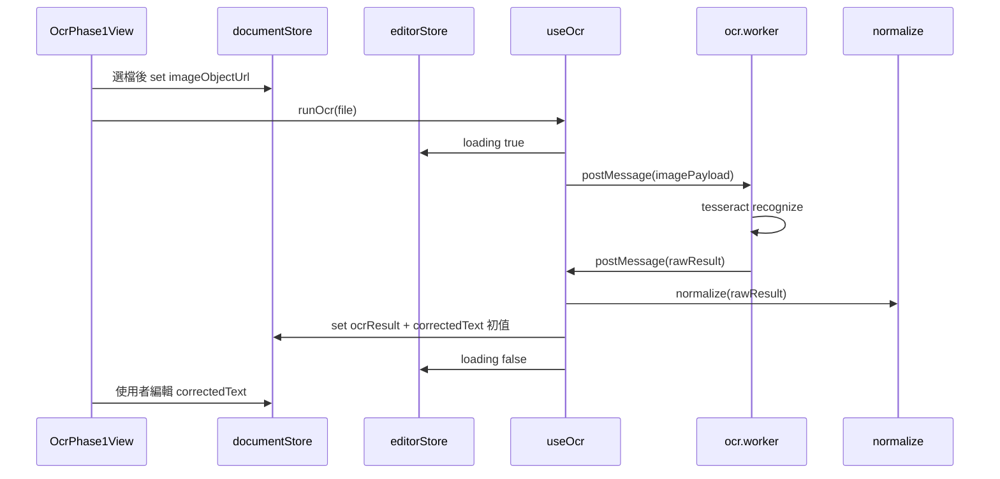

# Phase 1：OCR Core 實作計畫

## 與文件的對齊

- [docs/INFO.md](d:\2026\Privacy-Shield-Editor\docs\INFO.md)：Phase 1 為 **image upload → OCR worker → OCR result display → manual correction**；OCR 須在 **Worker**；建議目錄 `core/`、`composables/`、`workers/`、`stores/`、`types/`。
- [docs/PROGRESS.md](d:\2026\Privacy-Shield-Editor\docs\PROGRESS.md)：實際程式幾乎尚未開始，可從空白結構銜接現有 [src/App.vue](d:\2026\Privacy-Shield-Editor\src\App.vue) / [src/main.ts](d:\2026\Privacy-Shield-Editor\src\main.ts)。

## package.json 依賴檢查

| 用途                                         | 狀態                                              |
| -------------------------------------------- | ------------------------------------------------- |
| Vue 3、Vite、TypeScript                      | 已安裝                                            |
| Pinia                                        | 已安裝                                            |
| Tesseract.js                                 | 已安裝（^7.0.0）                                  |
| pdf-lib                                      | 已安裝（**Phase 2 匯出**用，Phase 1 可不 import） |
| Canvas API                                   | **無需 npm**（瀏覽器內建）                        |
| PrimeVue、Tailwind、vue-router、@vueuse/core | 已安裝，Phase 1 UI 可逐步採用                     |

**結論**：Phase 1 OCR core **不需要再補套件**。若實作自訂 Worker 時遇到路徑/資源問題，再依 Tesseract 官方方式設定 `workerPath` / `corePath`（屬實作細節，非缺少 dependency）。

---

## 1. 需要建立的檔案（精簡版）

建議第一波只開這些（可依進度把 UI 拆成兩個 component，不必一次拆很碎）：

| 路徑                                                                                                                 | 責任                                                                                                                                                                                                                           |
| -------------------------------------------------------------------------------------------------------------------- | ------------------------------------------------------------------------------------------------------------------------------------------------------------------------------------------------------------------------------ | ---------------------------------------------------------------------------------------------------------------------------------------------------------- |
| [src/types/ocr.ts](d:\2026\Privacy-Shield-Editor\src\types\ocr.ts)（新建）                                           | 定義 OCR 結果型別：例如 `OcrWord`（text + bbox）、`OcrResult`（words 或 lines 列表）、Worker 與主執行緒之間的 **message payload** 型別。                                                                                       |
| [src/core/ocr/normalize.ts](d:\2026\Privacy-Shield-Editor\src\core\ocr\normalize.ts)（新建）                         | **純函式**：把 Tesseract 回傳的 `words`/`symbols` 轉成統一的 `OcrWord[]`（座標格式一致、可選簡單 trim）；**不依賴 Vue/DOM**。                                                                                                  |
| [src/workers/ocr.worker.ts](d:\2026\Privacy-Shield-Editor\src\workers\ocr.worker.ts)（新建）                         | **唯一 OCR Worker**：收訊息（例如影像來源：Blob/ArrayBuffer/ImageBitmap 的約定）、內部 `createWorker('eng')`（或專案選定語言）、`recognize`、把 **結構化結果** postMessage 回主執行緒；可順便轉發 progress。                   |
| [src/composables/useOcr.ts](d:\2026\Privacy-Shield-Editor\src\composables\useOcr.ts)（新建）                         | **Vue 整合層**：用 `new Worker(new URL(...), { type: 'module' })` 建立 Worker；提供 `runOcr(file                                                                                                                               | imageUrl)`、`loading`/`error`/`progress`；收到結果後呼叫 `normalize`，再寫入 **Pinia**（或回傳給呼叫端由 store action 寫入）。onUnmounted 時 `terminate`。 |
| [src/stores/document.ts](d:\2026\Privacy-Shield-Editor\src\stores\document.ts)（新建）                               | **document store**（對齊 INFO）：`imageObjectUrl`（或 metadata）、`ocrResult: OcrResult                                                                                                                                        | null`、手動修正後的 **editable text**（最小可用：一個 `correctedText`字串，或`words` 的可編輯副本擇一）。                                                  |
| [src/stores/editor.ts](d:\2026\Privacy-Shield-Editor\src\stores\editor.ts)（新建）                                   | **editor store**：`isOcrLoading`、`ocrError`、`ocrProgress` 等 UI 狀態（與文件分離，避免 document store 膨脹）。                                                                                                               |
| [src/components/OcrPhase1View.vue](d:\2026\Privacy-Shield-Editor\src\components\OcrPhase1View.vue)（新建，名稱可調） | **UI 極小集合**：`<input type="file" accept="image/*">`、預覽 ``、按鈕「執行 OCR」、結果區（可先做 **textarea** 綁 `correctedText` 達成 manual correction）。元件內只做事件轉送，商業邏輯在 composable/store。 |
| 路由或 [src/App.vue](d:\2026\Privacy-Shield-Editor\src\App.vue)                                                      | 掛上 `OcrPhase1View`，讓 dev 可跑通端到端。                                                                                                                                                                                    |

**刻意不做（避免過度設計）**：三層 Canvas、PII、匯出、複雜版面還原——留到後續 Phase。

---

## 2. Module 之間如何互動

- **單向資料流**：UI → composable / store → Worker；回來經 **normalize** → store → UI。
- **core** 只被 composable（或 store action）呼叫，不與 Worker 直接雙向耦合：Worker 回 raw Tesseract 形狀，normalize 負責切成專案標準型別。

---

## 3. Worker 與 Composable 的關係（職責邊界）

|          | Worker (`ocr.worker.ts`)                                     | Composable (`useOcr.ts`)                                                                       |
| -------- | ------------------------------------------------------------ | ---------------------------------------------------------------------------------------------- |
| 執行環境 | 無 Vue、無 DOM                                               | Vue 執行緒、可存取 reactive / Pinia                                                            |
| 責任     | 載入/快取 Tesseract worker、執行辨識、回傳 **可序列化** 資料 | 建立/銷毀 Worker、`postMessage`、Promise 化、**進度與錯誤**、呼叫 `normalize`、**更新 stores** |
| 狀態     | 不持有 Pinia；最多 Worker 內區域變數快取 Tesseract 實例      | 持有 `loading/error/progress` 或只寫 editor store                                              |

**原則**：Worker 不做 UI 決策；Composable 不做像素級 OCR 演算法，只編排流程。

**實作注意**：若發現在「Worker 內再呼叫 `createWorker`」於目標瀏覽器／打包設定下不相容，可退回 **只在主執行緒使用 Tesseract 的 `createWorker()`**（其內部仍會用 Web Worker 跑 OCR），仍滿足「辨識在 Worker 中執行」，僅專案自訂 `src/workers/ocr.worker.ts` 改為薄層或暫以 composable 直連——優先以**可運作**為準，不必堅持巢狀 Worker。

---

## 4. 最小可運作流程（上傳圖片 → OCR）

1. 使用者選圖 → 建立 `URL.createObjectURL(file)` → 寫入 **document store**（並在替換檔案時 `revokeObjectURL`）。
2. 使用者按「執行 OCR」→ **useOcr** 將影像用約定格式送進 **ocr.worker**（例如 `createImageBitmap` 後 transfer，或送 `ArrayBuffer`，擇一種並貫徹型別）。
3. Worker 回傳辨識結果 → composable 呼叫 **normalize** → 更新 **document store**（並把 `correctedText` 設成與全文一致的起始值）。
4. 畫面用 `` 顯示圖、用 `<textarea>`（或簡單列表）顯示/編輯文字 → 完成 Phase 1 的「顯示 + 手動修正」最小閉環。

**驗收**：`pnpm dev`（或 npm）下，選一張含英文圖片，能看見 OCR 文字且可手動改字；無後端、無 PDF 匯出要求。

---

## 5. 與現有專案的銜接

- 在 [src/main.ts](d:\2026\Privacy-Shield-Editor\src\main.ts) 已掛 Pinia 的前提下，新增上述兩個 store 並在 UI 使用即可。
- [vite.config.ts](d:\2026\Privacy-Shield-Editor\vite.config.ts) 通常不需為 Worker 大改；若 Tesseract 資源載入報錯，再補 `optimizeDeps` / `assetsInclude` 等小調（實作時處理）。
